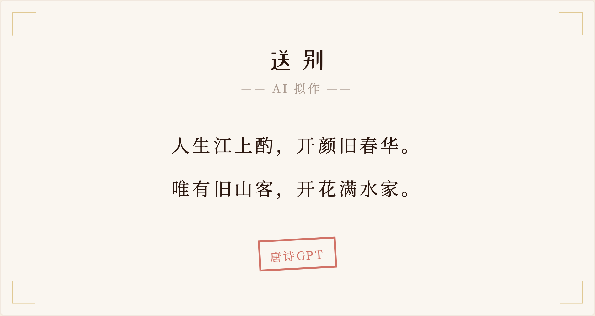

# tangshi-gpt

A character-level GPT model that generates Chinese poetry, trained on ~5,000 Tang dynasty (唐朝) poems.

## Overview

This project implements a decoder-only transformer from scratch using PyTorch. The model learns to generate classical Chinese poems character by character, and can produce new poems given a title as a prompt.

### Architecture

- **Tokenizer**: Character-level tokenizer with special tokens (`<sos>`, `<eos>`, `<sep>`, `<pad>`, `<unk>`)
- **Model**: GPT with multi-head self-attention, feed-forward layers, and residual connections
- **Default config**: 6 layers, 8 heads, 256 embedding dimensions, context length of 256

### Data

Tang dynasty poems (唐诗) sourced from the [chinese-poetry](https://github.com/chinese-poetry/chinese-poetry) dataset. Each poem is encoded as:

```
<sos> [Title] <sep> [Content] <eos>
```

## Project Structure

```
├── data/                    # Tang dynasty poem JSON files
├── checkpoints/             # Saved model checkpoints
├── src/
│   ├── model.py             # Poem dataclass
│   ├── data_preparation.py  # Data loading and train/val split
│   ├── tokenizer.py         # Character-level tokenizer
│   ├── gpt.py               # Transformer model (SelfAttentionHead, MultiHeadAttention, FeedForward, TransformerLayer, GPT)
│   ├── train.py             # Training loop and checkpoint saving
│   └── generate.py          # CLI for generating poems from a checkpoint
└── requirements.txt
```

## Getting Started

### Prerequisites

- Python 3.10+
- PyTorch 2.10+

### Installation

```bash
python -m venv .venv
source .venv/bin/activate
pip install -r requirements.txt
```

### Training

```bash
python src/train.py
```

The training script will:
1. Load and shuffle all poems, split into 90% train / 10% validation
2. Build a character-level vocabulary
3. Train the GPT model for 10,000 iterations
4. Save a checkpoint to `checkpoints/`

> **Note:** <br>
> I trained for 10,000 iterations on a single GPU(Tesla T4) which took ~1.5 hours.
>   - If you want to train, you can adjust the hyperparameters in `train.py` (e.g., `max_iters`, `batch_size`, `learning_rate`) to fit your resources and needs.
>   - I shared the trained checkpoint in `checkpoints/checkpoint.pt` for you to generate poems without training.

### Generating Poems

After training, generate poems from a saved checkpoint:

```bash
python src/generate.py checkpoints/<checkpoint>.pt --title "春望"
```

Omit `--title` to generate without a title prompt.

Use `--temperature` to control the randomness of the output (default: `1.0`). Lower values produce more deterministic results, higher values increase diversity:

```bash
python src/generate.py checkpoints/<checkpoint>.pt --title "春望" --temperature 0.8
```

Use `--top-p` for nucleus sampling (default: `1.0`). This restricts sampling to the smallest set of tokens whose cumulative probability exceeds the threshold, filtering out unlikely tokens:

```bash
python src/generate.py checkpoints/<checkpoint>.pt --title "春望" --top-p 0.9
```

Both options can be combined:

```bash
python src/generate.py checkpoints/<checkpoint>.pt --title "春望" --temperature 0.8 --top-p 0.9
```

## Online Demo

A live demo of the poem generation can be found at [tangshi-gpt](http://tangshi-gpt-models.s3-website-ap-southeast-1.amazonaws.com). 



## License

MIT
