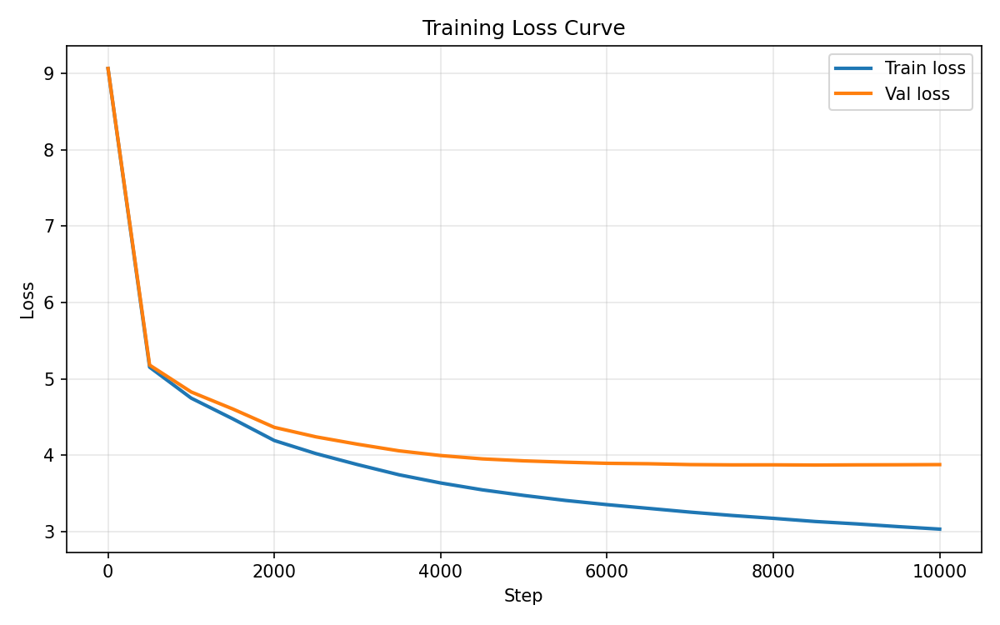
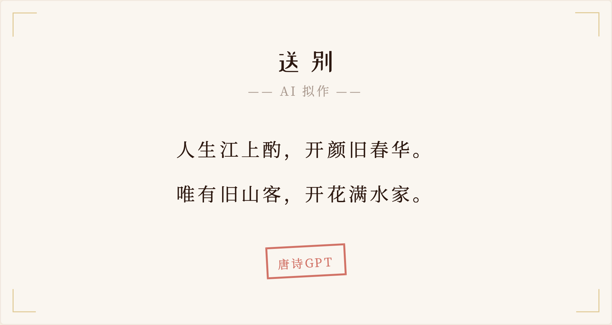

# tangshi-GPT

A character-level GPT model that generates Chinese poetry, trained on ~37,000 Tang dynasty (唐朝) poems.

## Overview

This project implements a decoder-only transformer from scratch using PyTorch. The model learns to generate classical Chinese poems character by character, and can produce new poems given a title as a prompt.

### Architecture

- **Tokenizer**: Character-level tokenizer with special tokens (`<sos>`, `<eos>`, `<sep>`, `<pad>`, `<unk>`)
- **Model**: GPT with multi-head self-attention, feed-forward layers, and residual connections
- **Default config**: 6 layers, 8 heads, 256 embedding dimensions, context size of 256 (the longest poem is ~200 tokens after encoding; 256 is the nearest power of 2 that fits all poems while keeping tensor dimensions GPU-friendly)

> **Implementation note:** In the standard transformer, the projection matrices W_q, W_k, W_v each have shape `(d_model, d_model)`. In this implementation, each `SelfAttentionHead` uses separate W_q, W_k, W_v matrices of shape `(d_model, head_size)` where `head_size = d_model // n_head`. The `MultiHeadAttention` module then concatenates the outputs of all heads back to `d_model` dimensions. This is mathematically equivalent to a single `(d_model, d_model)` projection followed by a split, but makes the per-head computation more explicit and easier to understand. In production implementations, a single `(d_model, d_model)` matrix is preferred as it allows the projection for all heads to be computed in one batched operation, which is more efficient on GPUs.

### Data

Tang dynasty poems (唐诗) sourced from the [chinese-poetry](https://github.com/chinese-poetry/chinese-poetry) dataset. Each poem is encoded as:

```
<sos>[Title]<sep>[Content]<eos>
```

## Project Structure

```
├── data/                    # Pre-split train/val/test poem JSON files
├── checkpoints/             # Saved model checkpoints
├── src/
│   ├── model.py             # Poem dataclass
│   ├── data_preparation.py  # Data loading from train/val/test splits
│   ├── tokenizer.py         # Character-level tokenizer
│   ├── gpt.py               # Transformer model (SelfAttentionHead, MultiHeadAttention, FeedForward, TransformerLayer, GPT)
│   ├── train.py             # Training loop and checkpoint saving
│   ├── generate.py          # CLI for generating poems from a checkpoint
│   ├── evaluate.py          # Comprehensive evaluation script (perplexity, structure, rhyme, diversity)
│   └── rhyme_utils.py       # Rhyme checking via Pingshui rhyme table (平水韵)
└── requirements.txt
```

## Getting Started

### Prerequisites

- Python 3.10+
- PyTorch 2.10+

### Installation

```bash
python -m venv .venv
source .venv/bin/activate
pip install -r requirements.txt
```

### Training

```bash
python src/train.py
```

The training script will:
1. Load poems from pre-split train/val/test files (30,087 train / 3,346 val / 3,717 test)
2. Build a character-level vocabulary (7,075 tokens: 5 special + 7,070 characters)
3. Train the GPT model (~8.4M parameters) for 10,000 iterations
4. Save a checkpoint to `checkpoints/`

> **Note:** <br>
> I trained for 10,000 iterations on a single GPU(Tesla T4) which took ~1.5 hours.
>   - If you want to train, you can adjust the hyperparameters in `train.py` (e.g., `max_iters`, `batch_size`, `learning_rate`) to fit your resources and needs.
>   - I shared the trained checkpoint in `checkpoints/checkpoint.pt` for you to generate poems without training.

#### Results



| Step | Train Loss | Val Loss |
|------|-----------|----------|
| 0 | 9.0631 | 9.0637 |
| 500 | 5.1546 | 5.1817 |
| 1000 | 4.7492 | 4.8301 |
| 2000 | 4.1941 | 4.3665 |
| 4000 | 3.6388 | 3.9979 |
| 6000 | 3.3552 | 3.8960 |
| 8000 | 3.1760 | 3.8761 |
| 9999 | 3.0349 | 3.8792 |

Val loss plateaus around step 6000 (~3.87) while train loss continues to drop, indicating overfitting in the later stages of training. Potential mitigations include learning rate scheduling (warmup + cosine decay), early stopping, and increasing weight decay.

### Evaluation

Evaluate a checkpoint across four dimensions: test-set perplexity, structural validity, rhyme consistency, and qualitative spot-checks.

```bash
python src/evaluate.py checkpoints/<checkpoint>.pt
```

For a quick perplexity-only run (no generation):

```bash
python src/evaluate.py checkpoints/<checkpoint>.pt --perplexity-only
```

Customize the number of generated samples and sampling parameters:

```bash
python src/evaluate.py checkpoints/<checkpoint>.pt --num-samples 500 --temperature 0.8 --top-p 0.9
```

#### Results

Evaluation of the shared checkpoint (`checkpoints/checkpoint.pt`) on 200 generated poems:

| Metric | Generated | Test Reference |
|---|---|---|
| Perplexity | — | 48.07 |
| Structural validity | 99.5% | 99.3% |
| Rhyme consistency | 63.6% | 87.3% |
| Distinct-2 | 0.7902 | 0.8105 |

Structural validity checks whether a poem follows the standard 绝句 (4-line) or 律诗 (8-line) form with consistent line lengths of 5 or 7 characters — poems that don't pass are not necessarily bad, they may simply be other forms (e.g. 词, 古体诗). Rhyme consistency is evaluated using the Pingshui rhyme table (平水韵), the historical rhyme system used in Tang poetry.

### Generating Poems

After training, generate poems from a saved checkpoint:

```bash
python src/generate.py checkpoints/<checkpoint>.pt --title "春望"
```

Omit `--title` to generate without a title prompt.

Use `--temperature` to control the randomness of the output (default: `1.0`). Lower values produce more deterministic results, higher values increase diversity:

```bash
python src/generate.py checkpoints/<checkpoint>.pt --title "春望" --temperature 0.8
```

Use `--top-p` for nucleus sampling (default: `1.0`). This restricts sampling to the smallest set of tokens whose cumulative probability exceeds the threshold, filtering out unlikely tokens:

```bash
python src/generate.py checkpoints/<checkpoint>.pt --title "春望" --top-p 0.9
```

Both options can be combined:

```bash
python src/generate.py checkpoints/<checkpoint>.pt --title "春望" --temperature 0.8 --top-p 0.9
```

## Online Demo

A live demo of the poem generation can be found at [tangshi-GPT](http://tangshi-gpt-models.s3-website-ap-southeast-1.amazonaws.com). 



## References

- [Attention Is All You Need](https://arxiv.org/abs/1706.03762) — Vaswani et al., the original transformer paper
- [nanochat](https://github.com/karpathy/nanochat) — Andrej Karpathy's nanochat
- [Transformer Model Tutorial in PyTorch: From Theory to Code](https://www.datacamp.com/tutorial/building-a-transformer-with-py-torch) — DataCamp

## License

MIT
